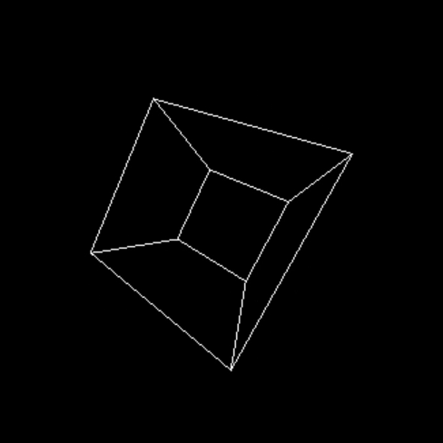

# cube_renderer

The goal of this project is to render a cube in 3d space using assembly. 

## todo

- restructure the drawn object to allow drawing different shapes 
- figure out how to easily make x86-64 assemlby universal across platforms
- prepare cmake for linux builds (both x86)
- read into avx and switch to it
- figure out how to get rid of nasty sin and cos calculations and rotation matrix filling 
- test clang
- do performance testing inbetween bigger changes to observe improvements

## x86

- working on windows
- assembly builds in nasm - https://nasm.us/
- builds using msys2 platform (gcc) - https://www.msys2.org/
- display and control implemented using SDL2 - https://www.libsdl.org/ (dll needs to be bundled with the binaries)

### x86-64 status

- currently worked on
- works on windows 
- todo's concern this version unless they say otherwise

### x86-32 status

- no plans for further development
- works on windows

## mips

### status

- no plans for further development
- working
- renders a frame onto a bitmap and writes it to a file

### dependencies

mars simulator v4.5 - http://courses.missouristate.edu/KenVollmar/MARS/index.htm
